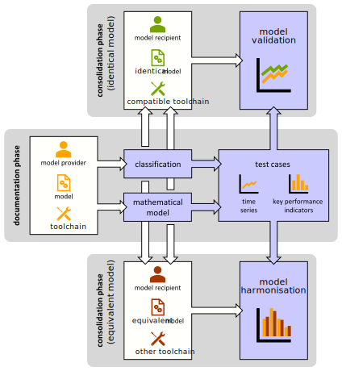
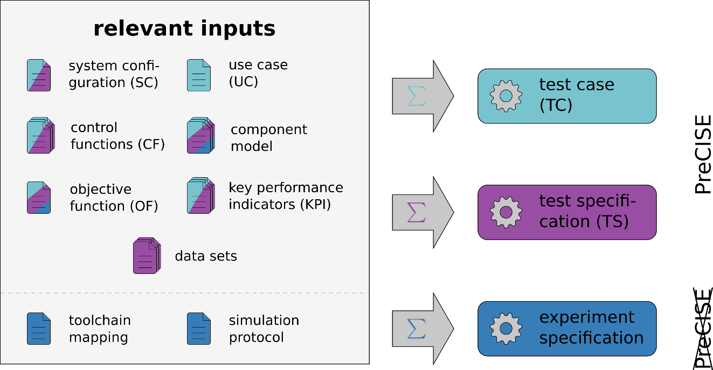
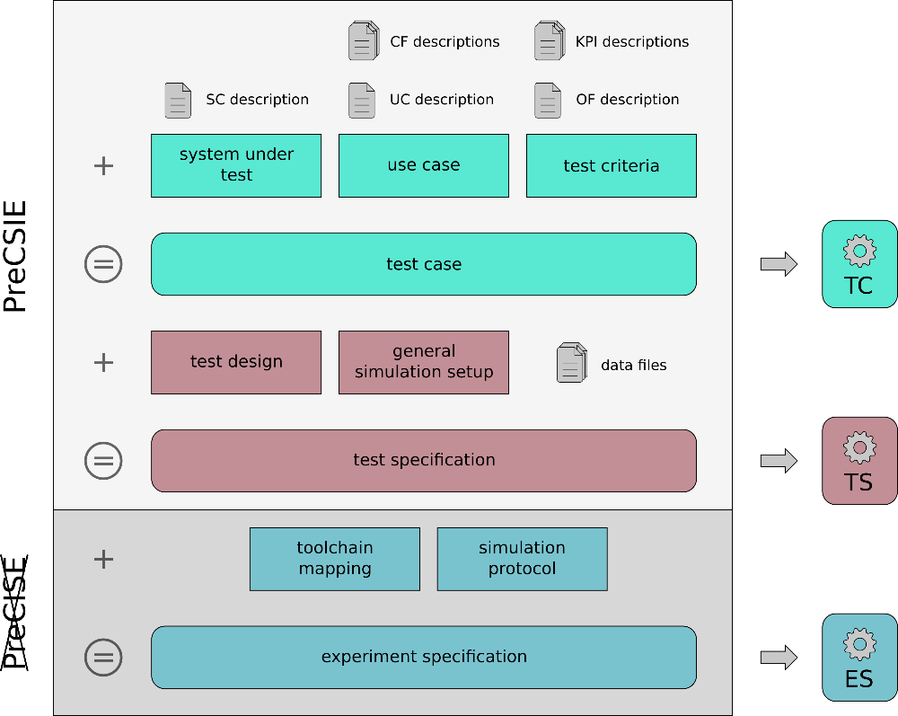
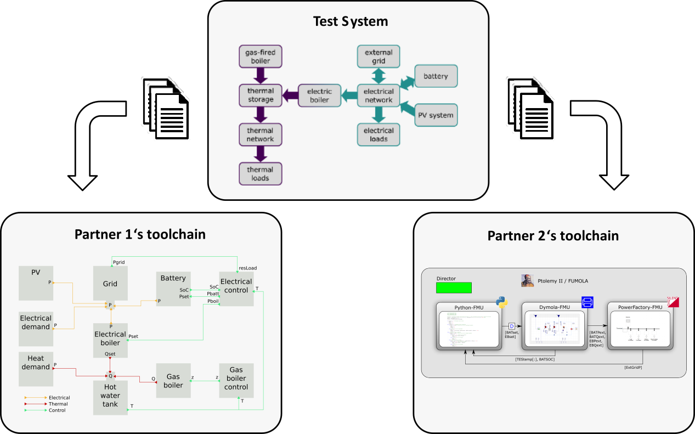
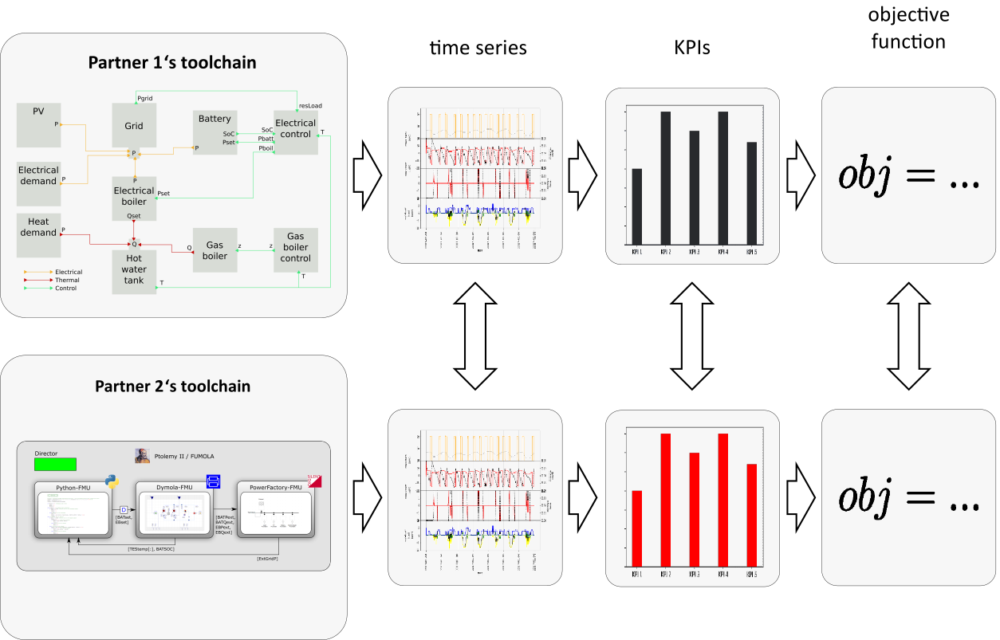
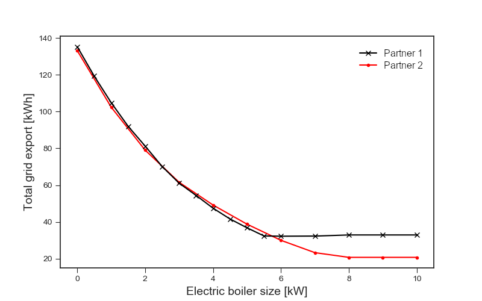
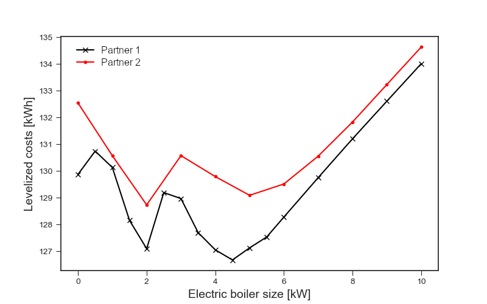

# The PreCISE Approach

## Overview

The *PreCISE* approach – an approach for <u>pre</u>paring <u>c</u>oncise
<u>i</u>nformation for <u>s</u>imulation <u>e</u>xperiments – is one of
the main results of the [SmILES project](https://cordis.europa.eu/project/id/730936).
Its main purpose is to
facilitate the collaboration among experts using different toolchains
and modelling paradigms. The intention behind the PreCISE approach is
not to force the use of the same types of models for different
toolchains or to identify the “best” model for a specific use case.
Rather, it is assumed that the diversity of challenges and obstacles
encountered in energy-related research must be met with an equal
diversity of modelling paradigms and toolchains. Within this context,
the goal is to enable workflows that combine different toolchains, in
order to create added value through unlocking synergies, see [Figure 1](#_Ref5791913)

Figure 1: Overview of the methodology’s
workflow. The blue boxes represent tasks covered directly by the methodology, white
boxes represent additional tasks that are in the responsibility of the model provider/recipient.

The PreCISE approach is implemented with the help of [templates](./templates/), which
allow to describe simulation experiments (and relevant associated data)
in a way that is independent of specific models, tools or methods. When
filled adequately, these templates contain all the information required
for implementing different types of simulation-based applications
(characterization, validation, verification, optimization).

In this section, an introduction of all the PreCISE concepts (and their
implementation) is given, and how they can be applied to define
simulation-based workflows. [Table 1](#_Ref1745354) shows an overview of
the aspects covered by the PreCISE approach.

<table tyle="border-collapse: collapse; width: 100%;">
<caption>
Table 1:
Overview of the aspects of simulation experiments covered by the PreCISE
approach.
</caption>
<colgroup>
<col style="width: 10%; border: 1px solid #000; padding: 8px;" />
<col style="width: 22%; border: 1px solid #000; padding: 8px;" />
<col style="width: 36%; border: 1px solid #000; padding: 8px;" />
<col style="width: 29%; border: 1px solid #000; padding: 8px;" />
</colgroup>
<thead>
<tr>
<th></th>
<th style="text-align: center; border: 1px solid #000; padding: 8px; background: #eee;">Documentation of …</th>
<th style="text-align: center; border: 1px solid #000; padding: 8px; background: #eee;">Type of information</th>
<th style="text-align: center; border: 1px solid #000; padding: 8px; background: #eee;">Examples</th>
</tr>
</thead>
<tbody>
<tr>
<td rowspan="3" style="text-align: center; border: 1px solid #000; padding: 8px; background: #eee;"><strong>Test Applications</strong></td>
<td style="text-align: left; border: 1px solid #000; padding: 8px;">use case</td>
<td style="border: 1px solid #000; padding: 8px;">desired dynamic behaviour of the entire system</td>
<td style="border: 1px solid #000; padding: 8px;">optimal storage operation, consumption reduction, peak shaving</td>
</tr>
<tr>
<td style="text-align: left; border: 1px solid #000; padding: 8px;">test case</td>
<td style="border: 1px solid #000; padding: 8px;">specific implementation of a use-case for an assessment according to
a test objective</td>
<td style="border: 1px solid #000; padding: 8px;">evaluate performance of peak shaving using a PV surplus and
batteries on a sunny day</td>
</tr>
<tr>
<td style="text-align: left; border: 1px solid #000; padding: 8px;">test specification</td>
<td style="border: 1px solid #000; padding: 8px;">defines how the TC’s object under investigation is embedded in a
specific test system</td>
<td style="border: 1px solid #000; padding: 8px;">define load profiles of PV systems and loads and specify expected
controller response</td>
</tr>
<tr>
<td rowspan="3" style="text-align: center; border: 1px solid #000; padding: 8px; background: #eee;"><strong>Reference Descriptions</strong></td>
<td style="text-align: left; border: 1px solid #000; padding: 8px;">system configuration</td>
<td style="border: 1px solid #000; padding: 8px;">static system data</td>
<td style="border: 1px solid #000; padding: 8px;">line impedances, network topology, nameplate data</td>
</tr>
<tr>
<td style="text-align: left; border: 1px solid #000; padding: 8px;">control function</td>
<td style="border: 1px solid #000; padding: 8px;">extrinsic dynamic behaviour of individual system parts</td>
<td style="border: 1px solid #000; padding: 8px;">solar MPP tracker, constant flow pump, energy market</td>
</tr>
<tr>
<td style="text-align: left; border: 1px solid #000; padding: 8px;">input data</td>
<td style="border: 1px solid #000; padding: 8px;">exogenous influence on the system and its components</td>
<td style="border: 1px solid #000; padding: 8px;">weather data, EV driving patterns, energy prices</td>
</tr>
<tr>
<td rowspan="3" style="text-align: center; border: 1px solid #000; padding: 8px; background: #eee;"><strong>Modelling and Optimization</strong></td>
<td style="text-align: left; border: 1px solid #000; padding: 8px;">component model</td>
<td style="border: 1px solid #000; padding: 8px;">Intrinsic dynamic behaviour of the system and its components</td>
<td style="border: 1px solid #000; padding: 8px;">thermal storage, heat pump, battery, substation</td>
</tr>
<tr>
<td style="text-align: left; border: 1px solid #000; padding: 8px;">key performance indicator</td>
<td style="border: 1px solid #000; padding: 8px;">provide a measure of performance for a certain system or
component</td>
<td style="border: 1px solid #000; padding: 8px;">district heat import, costs of electricity consumption</td>
</tr>
<tr>
<td style="text-align: left; border: 1px solid #000; padding: 8px;">objective function</td>
<td style="border: 1px solid #000; padding: 8px;">maps values of one or more variables onto a real number, intuitively
representing some associated "cost"</td>
<td style="border: 1px solid #000; padding: 8px;">minimization of operation costs, maximization of exported
exergy</td>
</tr>
</tbody>
</table>

### General Terminology

The following terms are used throughout this section:

- **Simulation models** are abstractions of the real world. They are
  used by computers to predict the results of some phenomenon, basically
  substituting physical experimentation. In most cases, simulation
  models are composed of **component models**, which represent specific
  parts of the overall investigated system.

- **Simulation tools** are computer programs that carry out the actual
  computations to perform a simulation, using simulation models as
  input. The whole process of modelling and simulation typically
  requires not only a (set of) simulation tool(s), but also auxiliary
  programs for data pre-processing, visualization and other tasks. Such
  a collection of programs is called a **simulation toolchain**.

- A **model of computation** is a collection of rules and instructions
  that governs the execution of the component models within a simulation
  model and the communication between them. A model of computation is an
  abstract concept, which is then implemented by a simulation tool.
  Examples are continuous time-driven simulations (e.g., implemented by
  Dymola and MATLAB/Simulink) or discrete event-based simulations (e.g.,
  AnyLogic or MATLAB/SimEvents).

- The construction of simulation models and component models is itself
  more an engineering discipline than a science. As such, modellers can
  make different assumption and chose from a large variety of different
  approaches to create a certain model. A **modelling paradigm**
  comprises the sum of all these assumptions and choices, explaining the
  details of how a model abstracts a part of the real world. Components
  models with contrasting underlying modelling paradigms can typically
  not be used in the same simulation model. For instance, an electrical
  power line can be abstracted as a conductor for electrical currents.
  Alternatively, it can be abstracted as a conduit for power flows,
  ignoring the underlying details of electron transport. Both
  abstractions are valid and have their value, but they focus on
  different aspects (and even require different models of computation).

### Test Applications

The core of the PreCISE approach comprises a formal structure for
defining simulation-based test applications. This formal structure aims
at separating the specification of the tested functionality from the
test criteria and the test design. This separation eases the sharing of
information, especially among partners with incompatible modelling
paradigms or simulation toolchains.

In the following, a brief overview of the PreCISE concepts (and their
implementations) related to the definition of test applications is
given.

#### Use Case

**Use cases** (UC) are the descriptions of applications that define the
important actors, systems and technologies, and their requirements that
are part of these applications. Use cases tell the story of how someone
or something interacts with a system to achieve a goal. A good use case
will describe the interactions that lead to either achieving or
abandoning the goal. A use case may describe multiple possible
interaction paths. [Table 2](#_Ref1737632) gives a short
overview of the categories defined in the UC description template.

[Link to UC description template](./templates/PreCISE_use-case_v1.docx)

<table tyle="border-collapse: collapse; width: 100%;">
<caption>
Table 2:
Overview of UC description categories
</caption>
<colgroup>
<col style="width: 42%" />
<col style="width: 57%" />
</colgroup>
<tbody>
<tr>
<td style="border: 1px solid #000; padding: 8px; background: #eee;"><strong>Description of use case</strong></td>
<td style="border: 1px solid #000; padding: 8px;">
Provide a general overview of the use case:

<ul>
<li>
name
</li>
<li>
scope and objective
</li>
<li>
narrative
</li>
<li>
optimality criteria
</li>
<li>
conditions
</li>
<li>
general remarks
</li>
</ul></td>
</tr>
<tr>
<td style="border: 1px solid #000; padding: 8px; background: #eee;"><strong>Graphical representation(s) of use case</strong></td>
<td style="border: 1px solid #000; padding: 8px;">Typically contains UML use case diagrams, UML sequence diagrams,
etc.</td>
</tr>
<tr>
<td style="border: 1px solid #000; padding: 8px; background: #eee;"><strong>Technical details</strong></td>
<td style="border: 1px solid #000; padding: 8px;">
Describes details of involved actors:

<ul>
<li>
name
</li>
<li>
type
</li>
<li>
description
</li>
<li>
grouping
</li>
</ul></td>
</tr>
<tr>
<td style="border: 1px solid #000; padding: 8px; background: #eee;"><strong>Step by step analysis of use case (optional)</strong></td>
<td style="border: 1px solid #000; padding: 8px;"><ul>
<li>
overview of use case scenarios
</li>
<li>
steps (alternative/complementary to sequence diagrams)
</li>
</ul></td>
</tr>
</tbody>
</table>

#### Test Case

A **test case** (TC) provides a set of conditions under which a test can
determine whether or how well a system, component or one of its aspects
is performing given its expected function. Test cases do not specify
implementation details such as the configuration of the system under
test; neither do they refer to a particular simulation setup. [Table 3](#_Ref1737743) gives a short
overview of the categories defined in the TC description template.

[Link to TC description template](./templates/PreCISE_test-case_v1.docx)

<table tyle="border-collapse: collapse; width: 100%;">
<caption>
Table 3:
Overview of TC description categories
</caption>
<colgroup>
<col style="width: 42%" />
<col style="width: 57%" />
</colgroup>
<tbody>
<tr>
<td style="border: 1px solid #000; padding: 8px; background: #eee;"><strong>About</strong></td>
<td style="border: 1px solid #000; padding: 8px;"><ul>
<li>
name
</li>
<li>
short description
</li>
</ul></td>
</tr>
<tr>
<td style="border: 1px solid #000; padding: 8px; background: #eee;"><strong>Scope and goal</strong></td>
<td style="border: 1px solid #000; padding: 8px;"><ul>
<li>
test objective (characterization, validation, verification,
optimization)
</li>
<li>
description incl. justification
</li>
<li>
link to system configuration
</li>
<li>
link to use case
</li>
</ul></td>
</tr>
<tr>
<td style="border: 1px solid #000; padding: 8px; background: #eee;"><strong>Identification of test components</strong></td>
<td style="border: 1px solid #000; padding: 8px;"><ul>
<li>
system under test
</li>
<li>
object under investigation
</li>
<li>
function under investigation
</li>
</ul></td>
</tr>
<tr>
<td style="border: 1px solid #000; padding: 8px; background: #eee;"><strong>Test criteria</strong></td>
<td style="border: 1px solid #000; padding: 8px;"><ul>
<li>
objective function / target metrics
</li>
<li>
acceptable test results
</li>
</ul></td>
</tr>
</tbody>
</table>

#### Test Specification

A **test specification** (TS) defines the mapping of a test case to a
specific test system, i.e., how the object under investigation is to be
embedded in a specific system under test. It clarifies the relation
between the object under investigation, the test objective and the test
configuration. As such, a TS defines the means and methods under which a
test is to be carried out and evaluated (test design). [Table 4](#_Ref1739695)
gives a short overview of the categories defined in the TS description
template.

[Link to TS description template](./templates/PreCISE_test-specification_v1.docx)

<table tyle="border-collapse: collapse; width: 100%;">
<caption>
Table 4:
Overview of TC description categories
</caption>
<colgroup>
<col style="width: 42%" />
<col style="width: 57%" />
</colgroup>
<tbody>
<tr>
<td style="border: 1px solid #000; padding: 8px; background: #eee;"><strong>About</strong></td>
<td style="border: 1px solid #000; padding: 8px;"><ul>
<li>
name
</li>
<li>
link to test case
</li>
<li>
test rationale
</li>
</ul></td>
</tr>
<tr>
<td style="border: 1px solid #000; padding: 8px; background: #eee;"><strong>Test system and test design</strong></td>
<td style="border: 1px solid #000; padding: 8px;"><ul>
<li>
specific test system
</li>
<li>
test parameters and output parameters
</li>
<li>
test design
</li>
</ul></td>
</tr>
<tr>
<td style="border: 1px solid #000; padding: 8px; background: #eee;"><strong>General simulation setup</strong></td>
<td style="border: 1px solid #000; padding: 8px;"><ul>
<li>
link to available component models
</li>
<li>
initial system state
</li>
<li>
temporal resolution
</li>
<li>
evolution of system state and test signals
</li>
<li>
source of uncertainty
</li>
<li>
stopping criteria
</li>
<li>
storage of data
</li>
</ul></td>
</tr>
<tr>
<td style="border: 1px solid #000; padding: 8px; background: #eee;"><strong>Additional information</strong></td>
<td style="border: 1px solid #000; padding: 8px;">Optionally, a link to a related test specification can be provided.
For instance, this can be used to provide a connection between two
simulation experiments that are associated through a workflow.</td>
</tr>
</tbody>
</table>

### Reference Descriptions

Simulation experiments are often linked to existing (or planned)
real-world systems. Providing a detailed description of these systems is
another important aspect of the PreCISE approach. The goal is to provide
all relevant information for enabling experts to extract the information
they need to generate or re-use their own simulation models.

In the following, a brief overview of the PreCISE concepts (and their
implementations) related to reference descriptions of existing (and
planned) systems is given.

#### System Configuration

A **system configuration **(SC) is a detailed, technical description of
an energy system (a list of energy
domains, system components and their interrelations such as connectivity
and hierarchy) and the
inherent properties of the components, i.e., component attributes and
constraints. The system
configuration is the "static" part of a system description in the sense
that, while dynamic attributes such
as transient parameters may be included in it, it does not contain
information about the use of the system.
The description of multi‐energy system configurations includes ‐ but is
not limited to ‐ specific building
typologies, local energy resources available, electric and thermal
networks, and embedded control layers. [Table 5](#_Ref1741324) gives a short
overview of the categories defined in the SC description template.

[Link to SC description template](./templates/PreCISE_system%20configuration_v1.docx)

<table tyle="border-collapse: collapse; width: 100%;">
<caption>
Table 5:
Overview of TC description categories
</caption>
<colgroup>
<col style="width: 42%" />
<col style="width: 57%" />
</colgroup>
<tbody>
<tr>
<td style="border: 1px solid #000; padding: 8px; background: #eee;"><strong>General description</strong></td>
<td style="border: 1px solid #000; padding: 8px;"><ul>
<li>
ID and name
</li>
<li>
description of context
</li>
<li>
climate
</li>
<li>
geographical features
</li>
</ul></td>
</tr>
<tr>
<td style="border: 1px solid #000; padding: 8px; background: #eee;"><strong>System breakdown (SBD)</strong></td>
<td style="border: 1px solid #000; padding: 8px;">Provides an organized overview of all components that constitute the
SC. All elements are conceptualized as classes and organized on
different branches of a tree to reflect different domains and levels of
detail. The “vertical” relations between the classes (sub-classing and
containment) are depicted analogous to UML notation.</td>
</tr>
<tr>
<td style="border: 1px solid #000; padding: 8px; background: #eee;"><strong>Graphical representation</strong></td>
<td style="border: 1px solid #000; padding: 8px;"><ul>
<li>
interfaces between elements of SBD
</li>
<li>
network diagrams
</li>
</ul></td>
</tr>
<tr>
<td style="border: 1px solid #000; padding: 8px; background: #eee;"><strong>Element connections</strong></td>
<td style="border: 1px solid #000; padding: 8px;">
Specifies “horizontal” connections of the SBD:

<ul>
<li>
ID and name of connection
</li>
<li>
type of connection
</li>
<li>
connected classes
</li>
</ul></td>
</tr>
<tr>
<td style="border: 1px solid #000; padding: 8px; background: #eee;"><strong>Element descriptions</strong></td>
<td style="border: 1px solid #000; padding: 8px;">
Specifies the elements of the SBD in more detail:

<ul>
<li>
element properties (interfaces, function, physical properties,
legal aspects, economic aspects, etc.)
</li>
<li>
characterization of element instances (number of elements in SC,
attached data)
</li>
</ul></td>
</tr>
</tbody>
</table>

#### Control Function

A **control function **(CF)**,** in the context of SmILES, is a
description of an embedded control system (or an
aspect thereof) which, together with the inherent physical properties of
the system itself, defines the
behaviour of the control system and its response to dynamic input.
Control functions can be seen as a
further detailing, or more formal description, of the mechanisms
governing the behaviour of individual
actors in a UC. [Table 6](#_Ref1742492) gives a short
overview of the categories defined in the CF description template.

[Link to CF description template](./templates/PreCISE_control-function_v1.docx)

<table tyle="border-collapse: collapse; width: 100%;">
<caption>
Table 6:
Overview of TC description categories
</caption>
<colgroup>
<col style="width: 42%" />
<col style="width: 57%" />
</colgroup>
<tbody>
<tr>
<td style="border: 1px solid #000; padding: 8px; background: #eee;"><strong>Overview</strong></td>
<td style="border: 1px solid #000; padding: 8px;"><ul>
<li>
introduction to the problem solved by the function or
algorithm
</li>
<li>
terminology (optional)
</li>
<li>
underlying methodology / theory
</li>
<li>
limitations
</li>
</ul></td>
</tr>
<tr>
<td style="border: 1px solid #000; padding: 8px; background: #eee;"><strong>Use Cases</strong></td>
<td style="border: 1px solid #000; padding: 8px;">Provides exemplary use cases to express functional requirements.
Bridges the gap between user needs and system functionality.</td>
</tr>
<tr>
<td style="border: 1px solid #000; padding: 8px; background: #eee;"><strong>Definition</strong></td>
<td style="border: 1px solid #000; padding: 8px;"><ul>
<li>
inputs / outputs
</li>
<li>
diagrams (data flow diagrams, sequence diagrams, state diagrams,
etc.)
</li>
<li>
deterministic functions (optional)
</li>
<li>
stochastic functions (optional)
</li>
<li>
implicit functions or algorithms (optional)
</li>
<li>
algorithms / pseudocode (optional)
</li>
</ul></td>
</tr>
</tbody>
</table>

#### Input Data

**Input data** is a detailed description of inputs required in the
context of a particular UC or TC. The input data describes the exogenous
variables or parameters that impact the specific behaviour of a system
and its components. Input data may be both static, e.g., by specifying
operating modes for a component, or dynamic, such as time series data.

The PreCISE approach provides a data format that was developed based on
the data requirements encountered in the SmILES project. The format
requires data and metadata to be in packaged together in a ZIP archive
file. The ZIP archive file contains an XML file that provides
information and metadata about all the packaged data. Data – tabular as
well as key‐value data – is stored in CSV files, which are likewise
contained in the ZIP archive files.

### Modelling and Optimization

The PreCISE approach also provides support for tasks directly related to
modelling, simulation and optimization. More specifically, it aims at
enabling experts to share information about their specific simulation
and optimization setups, independently of the test application at hand.

In the following, a brief overview of the PreCISE concepts (and their
implementations) related to modelling and optimization is given.

#### Model Consolidation

The PreCISE approach supports the definition and characterization of
component models. Based on this, **model consolidation** entails the
comparison of a model implementation with a reference, in order to
provide reasonable evidence that two implementations are equivalent or
at least consistent. [Table 7](#_Ref1748590) gives a short overview of
the categories defined in the component model description template.

[Link to model description template](./templates/PreCISE_model-description_v3.docx)

<table tyle="border-collapse: collapse; width: 100%;">
<caption>
Table 7:
Overview of model description categories
</caption>
<colgroup>
<col style="width: 42%" />
<col style="width: 57%" />
</colgroup>
<tbody>
<tr>
<td style="border: 1px solid #000; padding: 8px; background: #eee;"><strong>Classification</strong></td>
<td style="border: 1px solid #000; padding: 8px;">
Contains the context of the model regarding application and
technical details:

<ul>
<li>
domain
</li>
<li>
intended application (incl. scale and resolution)
</li>
<li>
modelling of spatial aspects (lumped, discretized, averaged,
etc.)
</li>
<li>
model dynamics (static, quasi-static, dynamic, etc.)
</li>
<li>
model of computation (time-continuous, discrete-event, state
machine, etc.)
</li>
<li>
functional representation (explicit, implicit)
</li>
</ul></td>
</tr>
<tr>
<td style="border: 1px solid #000; padding: 8px; background: #eee;"><strong>Mathematical model</strong></td>
<td style="border: 1px solid #000; padding: 8px;">
Provides information about the underlying mathematical model:

<ul>
<li>
variables (inputs, outputs, parameters, etc.)
</li>
<li>
model equations
</li>
<li>
initial conditions
</li>
<li>
boundary conditions
</li>
</ul></td>
</tr>
<tr>
<td style="border: 1px solid #000; padding: 8px; background: #eee;"><strong>Testing</strong></td>
<td style="border: 1px solid #000; padding: 8px;">
Specifies a test system for model consolidation (validation and
harmonization):

<ul>
<li>
test system configuration
</li>
<li>
inputs and parameters
</li>
<li>
control function (optional)
</li>
<li>
initial system state
</li>
<li>
temporal resolution
</li>
<li>
evolution of system state
</li>
<li>
expected results
</li>
</ul></td>
</tr>
</tbody>
</table>

#### Key Performance Indicator

A **key performance indicator** (KPI) is a parameter that provides a
measure of performance for a certain system or component. Within the
context of SmILES, the main focus is on KPIs that are calculated from
simulation results. [Table 8](#_Ref1749660) gives a short overview of
the categories defined in the KPI description template.

[Link to KPI description template](./templates/PreCISE_key-performance-indicator_v4.docx)

<table tyle="border-collapse: collapse; width: 100%;">
<caption>
Table 8:
Overview of KPI description categories
</caption>
<colgroup>
<col style="width: 42%" />
<col style="width: 57%" />
</colgroup>
<tbody>
<tr>
<td style="border: 1px solid #000; padding: 8px; background: #eee;"><strong>About</strong></td>
<td style="border: 1px solid #000; padding: 8px;"><ul>
<li>
name
</li>
<li>
mathematical symbol
</li>
<li>
contextual information
</li>
</ul></td>
</tr>
<tr>
<td style="border: 1px solid #000; padding: 8px; background: #eee;"><strong>Classification</strong></td>
<td style="border: 1px solid #000; padding: 8px;"><ul>
<li>
group (economic, technical, environmental, etc.)
</li>
<li>
domain (storage, network, conversion device, etc.)
</li>
<li>
significance
</li>
<li>
calculation
</li>
<li>
strengths and weaknesses
</li>
<li>
scoring / categorization
</li>
</ul></td>
</tr>
<tr>
<td style="border: 1px solid #000; padding: 8px; background: #eee;"><strong>Data requirements</strong></td>
<td style="border: 1px solid #000; padding: 8px;"><ul>
<li>
expected data source
</li>
<li>
data collection interval
</li>
<li>
expected reliability
</li>
</ul></td>
</tr>
</tbody>
</table>

#### Objective Function

An **objective function** (OF) is the interface between a generic
optimization method and an actual optimization problem. It provides an
abstraction of the actual problem by mapping the values of one or more
variables onto a real number (or a real-valued vector in the case of
multi-objective optimization). The optimization methods can then use
either the symbolic representation of the OF or only the values provided
by the OF (black-box optimization) to find a maximum or minimum.
[Table 9](#_Ref1750009) gives a short overview of the categories defined in the
OF description template.

[Link to OF description template](./templates/PreCISE_objective-function_v3.docx)

<table tyle="border-collapse: collapse; width: 100%;">
<caption>
Table 9:
Overview of OF description categories
</caption>
<colgroup>
<col style="width: 42%" />
<col style="width: 57%" />
</colgroup>
<tbody>
<tr>
<td style="border: 1px solid #000; padding: 8px; background: #eee;"><strong>About</strong></td>
<td style="border: 1px solid #000; padding: 8px;"><ul>
<li>
name
</li>
<li>
contextual information
</li>
</ul></td>
</tr>
<tr>
<td style="border: 1px solid #000; padding: 8px; background: #eee;"><strong>Classification</strong></td>
<td style="border: 1px solid #000; padding: 8px;"><ul>
<li>
group (economic, technical, environmental, etc.)
</li>
<li>
level (system, component)
</li>
<li>
domain (thermal, electrical, multi-energy, etc.)
</li>
<li>
intended use (optimal control, design optimization,
etc.)
</li>
<li>
problem specification (LP, MILP, etc.)
</li>
<li>
strengths and weaknesses
</li>
</ul></td>
</tr>
<tr>
<td style="border: 1px solid #000; padding: 8px; background: #eee;"><strong>Function definition</strong></td>
<td style="border: 1px solid #000; padding: 8px;"><ul>
<li>
mathematical symbol
</li>
<li>
optimization type (minimize, maximize)
</li>
<li>
calculation
</li>
</ul></td>
</tr>
<tr>
<td style="border: 1px solid #000; padding: 8px; background: #eee;"><strong>Constraints</strong></td>
<td style="border: 1px solid #000; padding: 8px;"><ul>
<li>
domain (economic, technical, environmental, etc.)
</li>
<li>
specification (linear, quadratic, non-linear)
</li>
<li>
form (equality, inequality, bound)
</li>
<li>
calculation
</li>
</ul></td>
</tr>
</tbody>
</table>

## Workflow support

### Goals and limitations

The assumption behind the PreCISE approach is that the diversity of
challenges and obstacles encountered in energy-related research must be
met with an equal diversity of modelling paradigms and toolchains.
Within this context, the goal is to enable workflows across the
(artificial) boundaries of incompatible toolchains or modelling
paradigms, in order to create added value through unlocking synergies.

Hence, workflows are in general intended to support the following two
tasks:

- **Documentation**: The PreCISE approach provides the means to describe
  real-world systems and related simulation setups in a coherent way.
  Furthermore, it allows to define the context and definition of
  simulation-based assessments in a way that is independent of specific
  models or tools. The implementation of the PreCISE concepts as
  template documents allows to easily share this information with
  others.

- **Implementation**: The PreCISE approach structures information in a
  way that enables experts to extract the information they need to
  create their own simulation setups. It also allows to provide
  sufficient information for comparisons of different simulation setups
  with a reference, in order to enable a consistency check across
  toolchains.

For a modeller implementing a simulation-based application in a specific
toolchain, the extraction of relevant information can be formally
understood as compiling an *Experiment Specification* (ES).
Conceptually, an ES describes the implementation of a simulation setup,
going into the details of the used models and tools. As such, the
PreCISE approach does not provide direct support for compiling an ES,
because it is in general closely tied to a specific toolchain or
modelling paradigm and therefore out of the scope of the PreCISE
approach.

### General Workflow

The concepts and the structure defined by the PreCISE approach can be
used in a variety of ways to define workflows. As such, the PreCISE
approach itself is not a general methodology for simulation-based
assessments. It rather provides the means to define methodologically
sound workflows for different types of applications (characterization,
validation, verification, optimization).

[Figure 2](#_Ref5791914) gives an impression of the many possibilities
the PreCISE approach provides, by showing with the help of a colour
coding which PreCISE concepts are potentially relevant inputs for
defining TCs and TSs (and ESs). For example, the definition of control
functions is typically a relevant input for defining a TS’s specific
test system. But in case a certain detail of a control function is the
actual focus of an assessment, then this control function obviously also
must be referenced as part of the TC description.

Figure 2: Overview of
potential links between TC, TS (and ES) and all other PreCISE concepts.

This flexibility is of high importance, as different workflows are
required for different applications, especially when combining different
approaches. Nevertheless, for defining workflows, the concepts of
TC and TS are considered to be the most central elements of the PreCISE
approach, as they define the criteria and the setup of any assessment.
This is also reflected in [Figure 2](#_Ref5791914), where the colour
coding visualizes the potential use of the other PreCISE concepts for
the definition of TCs and TSs (and ESs).

An example of a typical workflow based on the PreCISE approach is given
below. This example shows how the PreCISE concepts can be applied
to document and share information in a structured way, enabling two
project partners to implement the same case study in different
toolchains and compare simulation results.

## Example of a Workflow Based on the PreCISE Approach

### Introduction

The aim of the work presented in this section was to provide a
proof-of-concept example in which the PreCISE approach is successfully
applied. To do so, a specific case study
was implemented in two different toolchains using the available PreCISE
description forms and data format. The PreCISE approach was used to
document and exchange information, enabling an efficient workflow for a
simulation-based assessment.

Both partners had the same starting point, i.e., the filled-in
description forms and data sets for the test system. The system itself
is a small multi-energy system with thermal and electric storages,
coupled through an electric boiler. The partners implemented the test
system in their respective toolchains and compared their results for
different key performance indicators (KPIs) and, finally, for their
optimal value for the electric boiler capacity.

The workflow is described in the next section. It is followed by a
summary of results and an analysis of their differences. Different
sources for such differences along the workflow are identified and
explained. Thus, this work showcases the benefits as well as potential
challenges of using the PreCISE approach.

### Workflow supported by PreCISE approach

The description of the case study via the PreCISE description forms and
data format is the basis for both partners. [Figure 3](#_Ref5795112)
shows how the PreCISE concepts are used in this specific case. The
partners together defined the context using the TC description and
specified a common TS. Based on this, the partners were able to
implement the TS in their own toolchains, see [Figure 4](#_Ref2354482).

<figure>

<figcaption>
Figure 3:
Overview of the workflow in terms of TC, TS and ES
specification.
</figcaption>
</figure>

<figure>

<figcaption>
Figure 4:
Modelling workflow supported by description forms and data
sets.
</figcaption>
</figure>

The toolchains are shortly described in the following:

- *Partner 1 Toolchain mapping***:** Partner 1 uses the *mosaik* \[2\] co-simulation
  framework to couple sub-models implemented in separate simulators.
  Each simulator (~class) is instantiated into entities (~objects),
  which are subsequently connected in a scenario. When writing these
  simulators, it is instructive to first define which physical units
  should be put into which simulators, which inputs and outputs they
  have, and how these are connected. For the scenario defined in
  Task 4.4, the straight-forward approach is to put each physical
  component and controller (as described in the SC) in a separate
  simulator. These simulators can then be outlined in Python scripts,
  with specific implementations added later. The experiment
  specification is illustrated in [Figure 4](#_Ref2354482) (bottom,
  left).

- *Partner 2 Toolchain mapping*: Partner 2 uses a co-simulation approach that relies
  on the Functional Mock-up Interface \[3\] specification for coupling
  simulators. The thermal domain is represented in a dynamic model in
  Modelica \[4\], using the *Modelica Standard Fluid* library and the
  *IBPSA* \[5\] library. The corresponding model is implemented in
  *Dymola* \[6\]. The electrical domain is represented in a quasi-static
  model in *DIgSILENT PowerFactory* \[7\], a power system simulation and
  analysis tool. The simulators are coupled via the *FUMOLA*
  co-simulation framework \[8\].

The first version of the PreCISE description provided only insufficient
information for an unambiguous mapping to the toolchain, e.g., no
parameters for a detailed battery model were given. As this ambiguity
was a potential source for inconsistencies, the partners adapted and
updated the description forms by adding details necessary for their
implementations (but no model or tool specific information). Based on
these improved descriptions, the models were implemented and used for
simulating the test case in the two toolchains.

### Comparison of results

To demonstrate that the PreCISE approach has been successful applied to
exchange information between the partners, the results from the two
implementations have been compared. As can be seen in the following, the
tool independent description provided through the PreCISE approach has
been in fact used to generate tool specific implementations, which also
produce consistent results.

Simulation results were systematically compared on multiple levels as
shown in [Figure 5](#_Ref2354632). The most detailed level is comparing
time series output for a specified variable, e.g., current electric
boiler heat generation. Time series can differ in, e.g., signal width,
signal occurrence, signal height, and can be influenced by many sources,
e.g., electric boiler control implementation or the underlying modelling
paradigm (dynamic or quasi-static). Key performance indicators (KPIs) on
the other hand are represented by a single number processed from
(multiple) time series. Thus, they are more suitable to compare
implementations that diverge in various aspects. And finally, one
aggregation level further, objective function values composed of
(multiple) KPIs were compared. It was expected that many low-level
differences present on a time-series level would vanish on a KPI or
objective function level.

<figure>

<figcaption>
Figure 5:
Comparison of results on multiple levels
</figcaption>
</figure>

Defined KPIs were compared for different electric boiler sizes. As an
example, [Figure 6](#_Ref2355039) shows the total exported electric
power of the system as a function of the boiler sizes. Results of both
partners show a similar characteristic, i.e., the power export is
reduced with increasing electric boiler size.

<figure>

<figcaption>
Figure 6:
Comparison of results from Partner 2 and Partner 1 for total electric power export
versus electric boiler sizes
</figcaption>
</figure>

The main goal of the test system was to find the optimal size of the
electric boiler using levelized costs for capacity and energy flows into
the system. [Figure 7](#_Ref2355241) shows the objective function over
the electric boiler size. The optimal values for the electric boiler
size found by each partner are summarized in [Table 10](#_Ref2355336).

<table style="width:46%;">
<caption>
Figure 7:
Objective function values from Partner 2 and Partner 1 versus electric boiler
sizes
</caption>
<colgroup>
<col style="width: 14%" />
<col style="width: 14%" />
<col style="width: 16%" />
</colgroup>
<thead>
<tr>
<th style="border: 1px solid #000; padding: 8px; background: #eee;">Partner</td>
<th style="border: 1px solid #000; padding: 8px; background: #eee;">Size [kW]</td>
<th style="border: 1px solid #000; padding: 8px; background: #eee;">Objective [€]</td>
</tr>
</thead>
<tbody>
<tr>
<td style="border: 1px solid #000; padding: 8px;">Partner 1</td>
<td style="border: 1px solid #000; padding: 8px;">4.5</td>
<td style="border: 1px solid #000; padding: 8px;">126.7</td>
</tr>
<tr>
<td style="border: 1px solid #000; padding: 8px;">Partner 2</td>
<td style="border: 1px solid #000; padding: 8px;">2.0</td>
<td style="border: 1px solid #000; padding: 8px;">128.7</td>
</tr>
</tbody>
</table>

Table 10: Optimal sizes and
corresponding objective function value for both partners

The optimal sizes found for the electric boiler were quite different.
However, these values only correspond to the global minima of the of the
objective function. Indeed, the overall shape – including the local
minima – are consistent. Furthermore, the absolute values of the
objective function are very close for both partners with a difference of
only 1.5%. In summary, the differences in results are small, which was
to be expected as the toolchains and modelling approaches used by Partner 2
and Partner 1 are similar.

### Conclusion

Both partners, Partner 2 and Partner 1, implemented the test system in their
respective toolchains. The implementations were compared with regards to
missing/ambiguous parameters, e.g., charging efficiency of battery, or
missing/ambiguous descriptions, e.g., no description of the electric
boiler controller. These ambiguities were mitigated by updating the
description forms and introducing additional parameters and adding
details. Differences in toolchain mappings, e.g., dynamic or
steady-state, on the other hand were left unchanged. Thus, in general,
the two following sources for differences in results were identified:

- Missing or insufficient descriptions or data sets provided for the
  system under study or its subcomponent

- Mapping the system under study to a specific toolchain

The first point, i.e., missing or insufficient knowledge about the
system was in this case reduced to a minimum using the PreCISE approach.
However, describing a system in a suitable degree of detail to enable an
unambiguous implementation in two different toolchains can be time
consuming. Thus, describing systems using the PreCISE approach should be
seen as a compromise between feasibility and accuracy.

## References

<table>
<colgroup>
<col style="width: 3%" />
<col style="width: 96%" />
</colgroup>
<tbody>
<tr>
<td>[1]</td>
<td>ERIGrid consortium, “Smart Grid configuration validation scenario
description method,” 2017.</td>
</tr>
<tr>
<td>[2]</td>
<td>The mosaik Smart Grid co-simulation framework, [Online]. Available:
http://mosaik.offis.de/.</td>
</tr>
<tr>
<td>[3]</td>
<td>T. Blochwitz, M. Otter, M. Arnold, C. Bausch and C. Clauß, “The
Functional Mockup Interface for Tool independent Exchange of Simulation
Models,” in <em>Proceedings of the 8th International Modelica
Conference</em>, 2011.</td>
</tr>
<tr>
<td>[4]</td>
<td>P. Fritzson, Introduction to Modeling and Simulation of Technical
and Physical Systems with Modelica, Wiley-IEEE Press, 2011.</td>
</tr>
<tr>
<td>[5]</td>
<td>IBPSA Project 1, “BIM/GIS and Modelica Framework for building and
community energy system design and operation,” [Online]. Available:
https://ibpsa.github.io/project1/.</td>
</tr>
<tr>
<td>[6]</td>
<td>DYMOLA Systems Engineering, “Multi-Engineering Modeling and
Simulation based on Modelica and FMI,” [Online]. Available:
http://dymola.com.</td>
</tr>
<tr>
<td>[7]</td>
<td>DIgSILENT PowerFactory, [Online]. Available:
http://www.digsilent.de/. [Accessed 12. 10. 2018].</td>
</tr>
<tr>
<td>[8]</td>
<td>FUMOLA - Functional Mock-up Laboratory, [Online]. Available:
http://fumola.sourceforge.net/. [Accessed 31. 10. 2017].</td>
</tr>
<tr>
<td>[9]</td>
<td>J. Eker, J. Janneck, E. Lee, J. Liu and X. Liu, “Taming
heterogeneity - the Ptolemy approach,” <em>Proceedings of the IEEE,</em>
vol. 91, no. 1, pp. 127-144, 2003.</td>
</tr>
</tbody>
</table>
